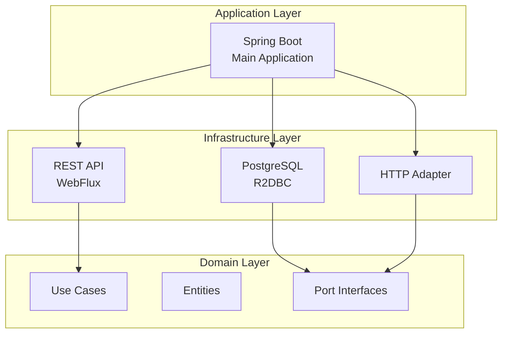
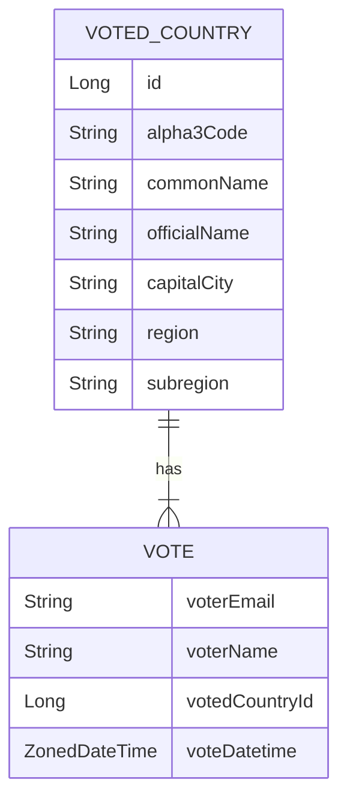

# Country Vote Service

Servicio backend desarrollado con Spring Boot que maneja la lógica de negocio para el sistema de votación de países. Implementado con arquitectura hexagonal, programación reactiva y acceso a datos asíncrono.

## 📋 Descripción

Country Vote Service es una aplicación web reactiva que proporciona endpoints REST para gestionar votos de países. El servicio se encarga de validar y persistir votos, generar rankings y proporcionar información de países mediante integración con APIs externas.

## 🏗️ Arquitectura

El proyecto sigue una arquitectura hexagonal (puertos y adaptadores) organizada en los siguientes módulos:

- **domain**: Contiene la lógica de negocio y modelos de dominio
- **application**: Implementa los casos de uso de la aplicación
- **adapters/inbound**: Adaptadores de entrada (controladores REST)
- **adapters/outbound**: Adaptadores de salida (persistencia, APIs externas)
- **bootstrap**: Configuración y punto de entrada de la aplicación

## 🛠️ Tecnologías

- **Spring Boot**: Framework de aplicación Java
- **Spring WebFlux**: Programación reactiva y endpoints REST no bloqueantes
- **Spring Data R2DBC**: Acceso reactivo a datos con R2DBC
- **PostgreSQL**: Base de datos relacional
- **Docker Compose**: Orquestación de contenedores para PostgreSQL
- **Gradle**: Sistema de construcción
- **Java 21**: Lenguaje de programación
- **Lombok**: Reducción de código boilerplate
- **Jakarta Validation**: Validación de datos de entrada

## 📦 Dependencias Principales

- Spring Boot WebFlux
- Spring Data R2DBC
- PostgreSQL Driver (R2DBC)
- Reactor Core
- Lombok
- Jakarta Validation

## 🚀 Prerrequisitos

- **Java 21** o superior
- **Docker 28.3.0** o superior
- **Docker Compose 2.38.1** o superior
- **Gradle 9** (se incluye wrapper en el proyecto)

> **Nota sobre Docker Compose**: El proyecto incluye un módulo de Spring Boot que permite levantar servicios con Docker Compose de forma integrada. En este caso, la base de datos PostgreSQL se levanta automáticamente como un servicio contenerizado mediante Docker Compose cuando se inicia la aplicación, siempre que `ENABLE_DOCKER_COMPOSE` esté habilitado (valor por defecto: `true`).

## 📥 Instalación

1. Clonar el repositorio y navegar al directorio del servicio:
```bash
cd country-vote-service
```

2. Construir el proyecto:
```bash
./gradlew build
```

## ⚙️ Configuración

El servicio se configura mediante variables de entorno y archivos de configuración. Los valores por defecto se encuentran en `bootstrap/src/main/resources/application.yaml`.

### Variables de Entorno

- `APP_SERVER_PORT`: Puerto del servidor (default: 8080)
- `APP_ACTUATOR_PORT`: Puerto de Actuator (default: 9090)
- `R2DBC_URL`: URL de conexión R2DBC (default: `r2dbc:postgresql://localhost:5432/country_vote_db`)
- `R2DBC_USERNAME`: Usuario de base de datos (default: `service`)
- `R2DBC_PASSWORD`: Contraseña de base de datos (default: `passw**rd`)
- `REST_COUNTRIES_BASE_URL`: URL base de REST Countries API (default: `https://restcountries.com/v3.1`)
- `ENABLE_DOCKER_COMPOSE`: Habilitar Docker Compose (default: `true`)

### Configuración de Base de Datos

El servicio utiliza Docker Compose para levantar PostgreSQL. La configuración se encuentra en `bootstrap/src/docker/compose.yaml`.

Variables de entorno para PostgreSQL:
- `SQL_DB_NAME`: Nombre de la base de datos
- `SQL_DB_USER`: Usuario de PostgreSQL
- `SQL_DB_PASSWORD`: Contraseña de PostgreSQL
- `SQL_DB_PORT`: Puerto de PostgreSQL

## 🏃 Ejecución

### Desarrollo Local

1. Asegúrate de que Docker esté ejecutándose

2. Ejecutar el servicio:
```bash
./gradlew :bootstrap:bootRun
```

El servicio estará disponible en `http://localhost:8080` y los endpoints de Actuator en `http://localhost:9090`.

### Con Docker Compose

El servicio puede levantar automáticamente PostgreSQL usando Docker Compose si está habilitado (`ENABLE_DOCKER_COMPOSE=true`).

## 📡 API Endpoints

Todos los endpoints están bajo el prefijo `/api`.

### Votación

#### Registrar Voto
```
POST /api/voting
Content-Type: application/json

{
  "voter": {
    "name": "Jon Doe",
    "email": "jon.doe@domain.com"
  },
  "countryAlpha3Code": "COL"
}
```

**Validaciones:**
- Email: formato válido, máximo 256 caracteres
- Nombre: obligatorio, máximo 256 caracteres
- Código de país: obligatorio, exactamente 3 caracteres (alpha-3)

**Respuesta Exitosa (200 OK):**
```json
{
  "id": 12,
  "voter": {
    "email": "jon.doe@domain.com",
    "name": "Jon Doe"
  },
  "votedCountryId": 5,
  "voteDatetime": "2026-01-18T09:49:46.585026-05:00"
}
```

**Errores:**

**400 Bad Request** - Error de validación:
```json
{
  "category": "VALIDATION_ERROR",
  "message": "Request validation failed",
  "timestamp": "2026-01-18T14:53:15.392516Z",
  "details": {
    "countryAlpha3Code": "no debe estar vacío"
  }
}
```

**412 Precondition Failed** - Violación de regla de negocio (email ya votó):
```json
{
  "category": "BUSINESS_RULE_VIOLATED",
  "message": "Usted ha votado previamente, solo está permitido votar una vez",
  "timestamp": "2026-01-18T14:52:32.530233Z"
}
```

#### Obtener Ranking de Países
```
GET /api/voting/ranking
```

**Respuesta Exitosa (200 OK):**
```json
[
  {
    "votedCountry": {
      "id": 5,
      "alpha3Code": "COL",
      "commonName": "Colombia",
      "officialName": "Republic of Colombia",
      "capitalCity": "Bogotá",
      "region": "Americas",
      "subregion": "South America"
    },
    "voteCount": 6
  },
  {
    "votedCountry": {
      "id": 1,
      "alpha3Code": "ESP",
      "commonName": "Spain",
      "officialName": "Kingdom of Spain",
      "capitalCity": "Madrid",
      "region": "Europe",
      "subregion": "Southern Europe"
    },
    "voteCount": 3
  }
]
```

Retorna los 10 países más votados ordenados por cantidad de votos descendente. Cada elemento incluye información completa del país y su conteo de votos.

### Países

#### Buscar Países
```
GET /api/countries?searchTerm=colombia
```

**Parámetros:**
- `searchTerm` (obligatorio): Término de búsqueda para filtrar por nombre, capital, región o subregión

**Respuesta Exitosa (200 OK):**
```json
[
  {
    "alpha3Code": "MAF",
    "commonName": "Saint Martin",
    "officialName": "Saint Martin",
    "capitalCity": "Marigot",
    "region": "Americas",
    "subregion": "Caribbean"
  },
  {
    "alpha3Code": "SPM",
    "commonName": "Saint Pierre and Miquelon",
    "officialName": "Saint Pierre and Miquelon",
    "capitalCity": "Saint-Pierre",
    "region": "Americas",
    "subregion": "North America"
  },
  {
    "alpha3Code": "BLM",
    "commonName": "Saint Barthélemy",
    "officialName": "Collectivity of Saint Barthélemy",
    "capitalCity": "Gustavia",
    "region": "Americas",
    "subregion": "Caribbean"
  },
  {
    "alpha3Code": "COL",
    "commonName": "Colombia",
    "officialName": "Republic of Colombia",
    "capitalCity": "Bogotá",
    "region": "Americas",
    "subregion": "South America"
  }
]
```

Retorna hasta 20 países que coincidan con el término de búsqueda. La búsqueda se realiza mediante integración con REST Countries API. Cada país incluye su código alpha-3, nombre común, nombre oficial, ciudad capital, región y subregión.

## 🔍 Health Checks y Monitoreo

El servicio expone endpoints de Actuator en el puerto configurado (default: 9090):

- `/actuator/health`: Estado de salud del servicio
- `/actuator/metrics`: Métricas de la aplicación
- `/actuator/prometheus`: Métricas en formato Prometheus
- `/actuator/info`: Información de la aplicación

## 🏗️ Arquitectura

El servicio está diseñado siguiendo los principios de arquitectura hexagonal (puertos y adaptadores), lo que permite una separación clara entre la lógica de negocio y los detalles de implementación.

### Arquitectura del Sistema

El siguiente diagrama muestra la estructura de capas y las relaciones entre los componentes principales:



### Modelo de Datos

El modelo de datos está compuesto por dos entidades principales: `VOTED_COUNTRY` y `VOTE`. La relación entre ellas es uno a muchos, donde un país puede tener múltiples votos.



#### Descripción de Entidades

**VOTED_COUNTRY**
- Almacena la información de los países que han recibido votos
- `id`: Identificador único del país
- `alpha3Code`: Código ISO alpha-3 del país (3 caracteres)
- `commonName`: Nombre común del país
- `officialName`: Nombre oficial del país
- `capitalCity`: Ciudad capital del país
- `region`: Región geográfica del país
- `subregion`: Subregión geográfica del país

**VOTE**
- Almacena los votos registrados por los usuarios
- `voterEmail`: Dirección de correo electrónico del votante (clave única)
- `voterName`: Nombre del votante
- `votedCountryId`: Referencia al país votado (clave foránea a VOTED_COUNTRY)
- `voteDatetime`: Fecha y hora en que se registró el voto

## 📁 Estructura del Proyecto

```
country-vote-service/
├── domain/                          # Módulo de dominio
│   └── src/main/java/.../
│       └── domain/
│           ├── aggregates/         # Agregados de dominio
│           ├── model/              # Modelos de dominio
│           └── ports/              # Puertos (interfaces)
│
├── application/                     # Módulo de aplicación
│   └── src/main/java/.../
│       └── application/
│           └── usecase/            # Casos de uso
│
├── adapters/
│   ├── inbound/
│   │   └── entrypoint-webflux/    # Controladores REST
│   │       └── src/main/java/.../
│   │           └── entrypoint/web/
│   │               ├── controllers/
│   │               └── dto/
│   │
│   └── outbound/
│       ├── persistence-postgres/   # Repositorios R2DBC
│       └── consumer-restcountries/ # Cliente REST Countries API
│
└── bootstrap/                       # Módulo de arranque
    └── src/
        ├── main/
        │   ├── java/.../           # Clase principal
        │   ├── resources/         # application.yaml
        │   └── docker/            # Docker Compose
        └── test/
```

## 🔐 Reglas de Negocio

1. **Un voto por email**: Cada dirección de correo electrónico solo puede votar una vez
2. **Validación de datos**: Todos los campos son obligatorios y deben cumplir con las validaciones especificadas
3. **Formato de email**: Debe ser un formato de email válido
4. **Código de país**: Debe ser un código alpha-3 válido (3 caracteres)

## 🔌 Integraciones

### REST Countries API

El servicio se integra con [REST Countries API](https://restcountries.com/) para obtener información de países. La URL base es configurable mediante la variable de entorno `REST_COUNTRIES_BASE_URL`.

## 📝 Notas de Desarrollo

- El proyecto utiliza programación reactiva con Project Reactor
- Los endpoints son no bloqueantes (WebFlux)
- La persistencia utiliza R2DBC para acceso reactivo a PostgreSQL
- Se utiliza Lombok para reducir código boilerplate

## 🤝 Contribución

Al contribuir, asegúrate de:
1. Seguir las convenciones de código establecidas
2. Documentar cambios significativos
